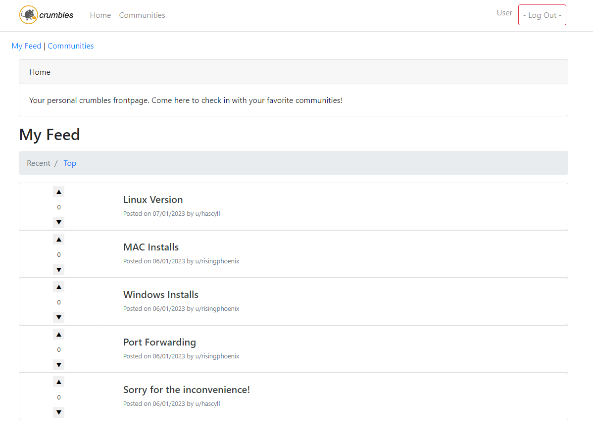

# crumbles

A community-based ("Reddit-style") chat app built with Flask.



Based on [flaskeddit](https://github.com/aqche/flaskeddit) by - **aqche** - [aqche](https://github.com/aqche)

## Features

- Registration and authentication.
- Create communities.
- Create community posts.
- Reply to community posts.
- Edit or delete your communities, posts, and replies.
- Join communities.
- Get a feed of posts from your joined communities.
- Upvote or downvote posts and replies.
- Sort communities, posts, and replies by latest or most popular.
- Moderate communities.
- Basic user profiles.

## Getting Started

These instructions will get you a copy of the project up and running on your local machine for development. See deployment for notes on how to deploy the project.

Visit the [demo](https://hascyll.pythonanywhere.com) to see a live system.

### Prerequisites

To run this application you need [Python](https://www.python.org/), [pip](https://pip.pypa.io/en/stable/), and [SQLite](https://www.sqlite.org/).

### Local Setup

Clone the project.

```sh
git clone https://github.com/pi-apps/crumbles.git
```

Setup a `virtualvenv` and use `pip` to install the project dependencies.

```sh
cd crumbles
python3 -m virualenv venv
source venv/bin/activate
pip3 install -r requirements.txt
```

Set the `FLASK_APP` environment variable, create the SQLite database, and start the app. Now you can give the application a try at [http://localhost:5000](http://localhost:5000)!

```sh
export FLASK_APP=flaskeddit.py
flask cli create_db
flask run
```


## Deployment

crumbles can be hosted on [pythonanywhere](https://www.pythonanywhere.com/). You have to register at pythonanywhere and upload the files.
Additionally you have to use the `__init__-pythonanywhere.py` file within the flaskeddit-folder.

Then make following changes to the wsgi configuration file in the web-tab:
```
# import flask app but need to call it "application" for WSGI to work
from flaskeddit import created_app as application  # noqa
```

## Built With

- [Flask](http://flask.pocoo.org/) - Python Framework
- [Bootstrap](https://getbootstrap.com/) - CSS Framework

## Contributing

Feel free to submit a pull request!

## Authors

- **Hascyll** - _Author_ - [Hascyll](https://github.com/Hascyll)


## License

This project is licensed under the PiOS License - see the [LICENSE](./LICENSE) file for more details.

## Acknowledgments

- [flaskeddit](https://github.com/aqche/flaskeddit) by - **aqche**- The inspiration for this site.
- **Phoenix** - Art Design
